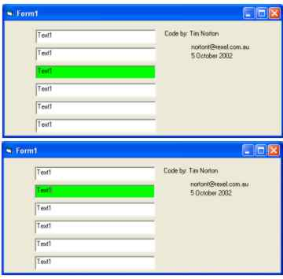



## Highlight Active Control with colour with out using GOT/LOST Focus

### Description

Highlight the active control in a different colour to draw attention. Does not require the gotfocus, lost focus for each control.

VERY EFFICIENT CODE
 
### More Info
 

             |
---                |---
**Submitted On**   |2002-10-05 15:08:54
**By**             |[Tim Norton](https://github.com/Planet-Source-Code/PSCIndex/blob/master/ByAuthor/tim-norton.md)
**Level**          |Intermediate
**User Rating**    |5.0 (20 globes from 4 users)
**Compatibility**  |VB 6\.0
**Category**       |[Custom Controls/ Forms/  Menus](https://github.com/Planet-Source-Code/PSCIndex/blob/master/ByCategory/custom-controls-forms-menus__1-4.md)
**World**          |[Visual Basic](https://github.com/Planet-Source-Code/PSCIndex/blob/master/ByWorld/visual-basic.md)
**Archive File**   |[Highlight\_14617010142002\.zip](https://github.com/Planet-Source-Code/tim-norton-highlight-active-control-with-colour-with-out-using-got-lost-focus__1-39829/archive/master.zip)

